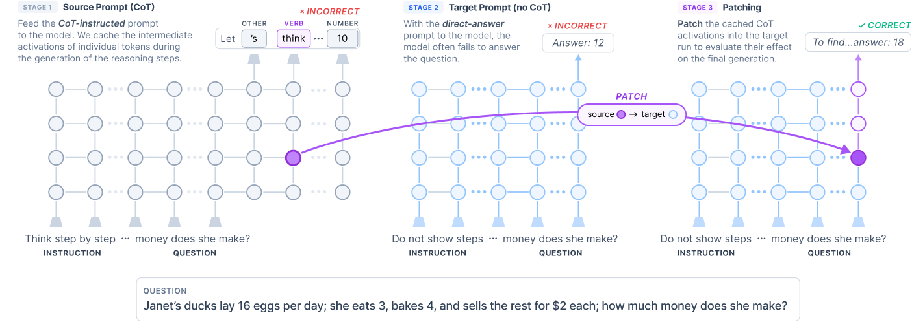

# When Chain-of-Thought Fails, the Solution Hides in the Hidden States

Code for the paper *When Chain-of-Thought Fails, the Solution Hides in the Hidden States*. It implements
activation patching to ask whether the hidden states of generated chain-of-thought (CoT) tokens contain
task-solving information, and where in the trace that information sits.

The setup uses **one model under two zero-shot prompting conditions for the same GSM-8K question**:

- a **source** run, prompted to reason step by step, whose residual hidden states are cached at every
  layer and every generated CoT token position;
- a **target** run, prompted to answer directly, which usually fails.

For a chosen layer, the hidden state at the target run's **final token position** is replaced with the
cached state of one source CoT token at that same layer, and the model then continues generating
normally. Because the model, target prompt and decoding are otherwise unchanged, the change in the final
answer isolates the effect of the patched state. Varying the source token and layer shows where
task-relevant information is encoded, including in traces where the source CoT itself answered
incorrectly.

<picture>
  <source media="(prefers-color-scheme: dark)" srcset="assets/patch-dark.png">
  <source media="(prefers-color-scheme: light)" srcset="assets/patch-light.png">
  
</picture>

*Stage 1 caches hidden states during the CoT generation. Stage 2 runs the same question under a
direct-answer prompt, which usually fails. Stage 3 patches one cached state into the target run's
final position and measures the effect on the answer.*

Experiments run in four stages:

1. **Generate** — evaluate a model on GSM-8K under the CoT and direct-answer prompts, producing two JSON
   files of prompts, generations and extracted answers.
2. **Patch** — `patch_position_sweep` patches one source hidden state per `(layer, target_pos,
   source_pos)` and saves the resulting generation, which is what patch success is scored from;
   `pe_analysis` computes the patch effect on the target run's answer probability.
3. **Postprocess** — `full_results` turns the sweep output into a labelled CSV, assigning each source
   token one of 12 role labels and each post-patch generation one of 7 behaviour types.
4. **Control** — `noise_control` replays the successful patches with the source state rotated to a fixed
   cosine similarity while keeping its norm, the direction-noise control of Appendix C.

The paper's configuration is LLaMA 3.1 8B-Instruct and Qwen 2.5 7B-Instruct on the 1,319 GSM-8K test
examples, greedy decoding, seed 42, batch size 1, `task.max_gen_len=400` (`task.source_max_gen_len=800`
for Qwen source runs), source hidden states taken from the generated CoT (`task.patch_from_generation=true`),
patching every other layer plus the final layer (`task.layer_stride=2 task.include_final_layer=true`) at
the final target position (`task.target_pos=-1`).

## Setup

This project uses [uv](https://docs.astral.sh/uv/) for environment and package management.

```bash
uv sync
```

This creates a virtual environment in `.venv/` and installs the project in editable mode. Run commands via
`uv run` (e.g. `uv run ri ...`), or activate the environment with `source .venv/bin/activate`.

Requires Python 3.10+, PyTorch and Transformers.

Postprocessing additionally needs spaCy and its English model:

```bash
uv sync --extra analysis
uv run python -m spacy download en_core_web_sm
```

## Configuration

All experiments are driven through [Hydra](https://hydra.cc/) configs composed from `ri/conf/`:

```
ri/conf/
├── config.yaml          # root — picks one task / model / dataset / tracking
├── task/                # evaluate, patch, cma, pe_analysis, patch_position_sweep, full_results, noise_control
├── model/               # llama_8b, qwen_7b
├── dataset/             # gsm8k
└── tracking/            # disabled, wandb
```

The entrypoint is `ri/main.py`, exposed as the `ri` console script. Override any value from the CLI with
dotted paths:

```bash
uv run ri task=patch model=qwen_7b task.source_layer=15 task.target_layer=15
```

Unknown override keys are rejected before anything is loaded, and task parameters are validated before
model weights are read. Add `--cfg job` to print the composed config and exit without loading a model —
the cheapest way to check that a set of overrides resolves.

Weights & Biases logging is off by default. Enable it with `tracking=wandb`; the project name and tags
live in `ri/conf/tracking/wandb.yaml`, and every task still writes its local outputs regardless.

### Environment variables

| Variable | Description | Default |
|----------|-------------|---------|
| `RI_CACHE_DIR` | HuggingFace model cache directory | `~/.cache/huggingface` |
| `PROJECTDIR` | Base for the logit cache (`$PROJECTDIR/patch_logits`) | `/tmp` |

`TRANSFORMERS_CACHE`, `HF_HOME` and `HUGGINGFACE_HUB_CACHE` are also honoured as fallbacks for the model
cache.

### Caching

- **Logit cache** — on by default. Per-source-position logits for PE analysis are written to
  `$PROJECTDIR/patch_logits/`. Disable with `task.cache_logits=false`, relocate with
  `task.logit_cache_dir`.
- **Generation cache** — off by default. Set `task.gen_cache_dir=<path>` on the `patch` or
  `patch_position_sweep` task to reuse source generations and their hidden states across runs. The sweep
  otherwise regenerates the source CoT for every `(layer, target_pos, source_pos)` patch, so set it for
  anything beyond a single layer and position.

To clear cached data, delete the relevant directories.

## Running experiments

### Step 1: Generate model outputs

Evaluate the model on GSM-8K with and without CoT prompts. These two files feed every patching task.

```bash
# CoT outputs
uv run ri task=evaluate \
    dataset.src_prompt_template=gsm8k_cot \
    task.batch_size=1 task.max_gen_len=400 seed=42 \
    task.output_file=outputs/single_batch_output_cot.json

# non-CoT outputs
uv run ri task=evaluate \
    dataset.src_prompt_template=gsm8k_non_cot \
    task.batch_size=1 task.max_gen_len=400 seed=42 \
    task.output_file=outputs/single_batch_output_non_cot.json
```

Templates available in `ri/prompts/templates/`: `gsm8k_cot`, `gsm8k_non_cot`, `gsm8k_no_system`. Select
with `dataset.src_prompt_template` and `dataset.tgt_prompt_template`.

`task=evaluate` supports batching and defaults to 16. Use `task.batch_size=1` for patching tasks; they are
only exercised at batch size 1.

### Step 2: Patching experiments

#### Patch position sweep

For each `(layer, target_pos, source_pos)` combination, patches one source CoT hidden state into the
target model and saves the generated text.

```bash
uv run ri task=patch_position_sweep \
    dataset.source_dataset=outputs/single_batch_output_cot.json \
    dataset.target_dataset=outputs/single_batch_output_non_cot.json \
    task.sample_idx=0 \
    task.patch_from_generation=true \
    task.gen_cache_dir=gen_cache \
    task.layer=15 \
    task.target_pos=-1 \
    task.output_dir=patch_pos_sweep_results/sample_0
```

Key overrides:

- `task.layer` — patch a specific layer (otherwise sweeps all layers)
- `task.start_layer`, `task.layer_stride` — control the layer sweep range
- `task.include_final_layer=true` — always include the last layer, even if `task.layer_stride` skips it
- `task.target_pos` — patch at a specific target position (otherwise sweeps all)
- `task.target_positions` — list of target positions, e.g. `task.target_positions=[0,-1]`
- `task.patch_from_generation` — take source hidden states from the generated CoT (default `true`); `false`
  patches from the source prompt tokens instead
- `task.max_gen_len` — generation budget for the source CoT and for the post-patch generation (default 400)
- `task.source_max_gen_len` — separate budget for the source CoT only (the paper uses 800 for Qwen)
- `task.gen_cache_dir` — cache the source generation and hidden states on disk (see Caching)
- `task.extraction_mode` — `flexible` (default) or `strict` answer extraction
- `task.resume=true` — skip completed output files
- `seed` — root-level, forwarded to the sweep

Output is a flat directory of `layer_<n>_pos_<p>.json` files. Two things to know:

- `<n>` is **1-indexed** while `task.layer` is 0-indexed, so `task.layer=15` writes `layer_16_pos_*.json`.
- Filenames do not encode `task.sample_idx`, so two samples written to one `task.output_dir` overwrite
  each other. Give each sample its own directory.

Dropping `task.layer` and `task.target_pos` sweeps the full grid, which is roughly 290,000 generations and
2,200 files for a single sample. Bound the sweep with the layer and target-position overrides, and use
`task.resume=true` to restart safely.

#### Patch effect (PE) analysis

For each source token position, patches its hidden state from every layer into every target position and
measures the change in the target model's answer probability. Source hidden states are always taken from
the generated CoT:

```
PE = (before_patch_target_prob - after_patch_target_prob) / max(after_patch_target_prob, 1e-10)
```

```bash
uv run ri task=pe_analysis \
    dataset.source_dataset=outputs/single_batch_output_cot.json \
    dataset.target_dataset=outputs/single_batch_output_non_cot.json \
    task.sample_idx=0 \
    task.output_dir=pe_output
```

Key overrides:

- `task.start_src_pos` — starting source position, negative indexing supported
- `task.target_positions` — list of target positions, e.g. `task.target_positions=[0,-1]`
- `task.cache_logits` — cache logits for reuse across runs (default: true)
- `task.resume=true` — skip completed source position files

Results are written to `<task.output_dir>/sample_<idx>/source_<pos>.json`, one file per source position,
with a `patch_effect` value per layer and target position.

### Step 3: Postprocess patch sweeps

`task=full_results` turns patch sweeps into a labelled CSV, adding per-source-token `entity_role` labels,
per-generation `generation_type` labels, numeric correctness, token-length columns, step segmentation and
sidecar codebooks. The taxonomies are defined in `ri/postprocess/codebooks.py` and
`ri/postprocess/generation_labels.py`.

Role labels are the 12 categories of Table 1 in the paper, written in upper case (`ENTITY`, `VERB`,
`QUANTITY`, `UNIT`, `STEP`, `OPERAND`, `OPERATOR`, `EQUALS`, `RESULT`, `NUMBER`, `PUNCT`, `OTHER`), and
generation types are the seven output types of Table 6 in snake case (`full_cot`, `equation_only`,
`partial_cot`, `final_only`, `text_only`, `noise`, `none`).

The aggregate results in the paper are computed from this table with the definitions of Section 3.4:
patch recoverability is whether any row of an example has `is_correct`, patch success density is the
per-example mean of `is_correct`, and the patch success rate of a group (a layer, a token role, a
position quartile) is the per-example success rate within that group averaged over the examples that
have it.

Two output schemas are available:

- `task.output_schema=full_results` — the full analysis table
- `task.output_schema=published_export` — a reduced CSV that joins in PE values; requires `task.pe_root`

Single sample from a flat sweep directory:

```bash
uv run ri task=full_results \
    task.sweep_root=patch_pos_sweep_results \
    task.output_schema=full_results \
    task.sample_idx=0 \
    task.output_file=outputs/full_results_sample0.csv
```

Multiple samples, one directory per sample:

```bash
uv run ri task=patch_position_sweep ... task.sample_idx=0 \
    task.output_dir=patch_pos_sweep_results/sample_0
uv run ri task=patch_position_sweep ... task.sample_idx=1 \
    task.output_dir=patch_pos_sweep_results/sample_1

uv run ri task=full_results \
    task.sweep_root=patch_pos_sweep_results \
    task.output_schema=full_results \
    task.output_file=outputs/full_results.csv
```

If `task.sweep_root` contains `sample_<n>/` subdirectories they are used and `task.sample_idx` is ignored;
otherwise the root is read as one flat sweep labelled with `task.sample_idx`.

Four files are written, named after `task.output_file`:

- `full_results.csv` — one row per `(sample_idx, layer, target_pos, source_pos)`
- `full_results_source_tokens.csv` — one row per source token with step and entity labels
- `full_results_entity_codes.json` — entity-role codebook
- `full_results_behavior_codes.json` — generation-behaviour codebook

Key overrides:

- `task.sweep_root` — root directory of the sweep(s) to read
- `task.output_file` — main CSV path; also determines the sidecar names
- `task.output_schema` — `full_results` or `published_export`
- `task.pe_root` — PE output root; required for `published_export`
- `task.eval_json` — original CoT eval JSON, improves `published_export` alignment
- `task.spacy_model` — spaCy pipeline for entity tagging (default `en_core_web_sm`)
- `task.source_tokens_file`, `task.entity_codes_file`, `task.behavior_codes_file` — override the sidecar
  paths derived from `task.output_file`
- `task.progress_every` — print progress every N samples (default 25; 0 disables)

`model.target_model_name` must contain `llama` or `qwen`; postprocessing derives its token-alignment
family from that string and raises otherwise.

### Step 4: Direction-noise control (Appendix C)

`task=noise_control` checks that recovery depends on the content of the patched state rather than on
perturbing the target position. It reads a `full_results` CSV, samples `task.n_examples` examples with the
root seed, and replays every patch that recovered the correct answer with the source state rotated to a
fixed cosine similarity `alpha` while keeping its norm:

```
h_tilde = ||h|| * (alpha * h / ||h|| + sqrt(1 - alpha^2) * u)
```

`u` is a random unit direction orthogonal to `h`, drawn once per patch from a seed derived from the root
seed and the patch coordinates and shared across all `alpha` levels, so the levels form a paired
comparison. `alpha=1` is the unmodified patch and `alpha=0` a fully random direction with the original
magnitude.

```bash
uv run ri task=noise_control \
    dataset.source_dataset=outputs/single_batch_output_cot.json \
    dataset.target_dataset=outputs/single_batch_output_non_cot.json \
    task.results_csv=outputs/full_results.csv \
    task.output_dir=noise_control_output
```

Key overrides:

- `task.alphas` — cosine levels, default `[1.0, 0.75, 0.5, 0.25, 0.0]`; override as `task.alphas=[0.5,0.0]`
- `task.n_examples` — examples to sample (default 100); `task.sample_indices=[3,17,42]` replays exactly
  those examples instead, which is how to shard the run across jobs
- `task.target_pos` — keep only patches at this requested target position (default: all in the CSV)
- `task.max_gen_len`, `task.source_max_gen_len`, `task.extraction_mode` — must match the sweep that produced
  the CSV, otherwise the replayed source CoT differs from the one whose patches succeeded
- `task.gen_cache_dir` — source-state cache; defaults to `<task.output_dir>/gen_cache`
- `task.resume=true` — skip patch/alpha pairs already present in the output files
- `task.summarize_only=true` — rebuild the summary from existing output files without loading a model

Output is one `sample_<idx>.jsonl` per example with a row per patch and `alpha` (generated text, predicted
number, correctness, and the patched token so drift from the original sweep is visible), plus `summary.csv`
with the percentage of patches that still recover the correct answer at each `alpha` (Table 8 in the
paper). Every row is a full generation: the paper's setting of 100 examples and five `alpha` levels is
roughly 325,000 generations, so shard with `task.sample_indices` and use `task.resume`.

The same perturbation is available on the single-run `patch` task through `task.perturb_cosine` and
`task.perturb_seed`.

### Standalone tasks

`patch` and `cma` run single configurations without the sweep machinery:

```bash
# Single patching run
uv run ri task=patch \
    dataset.source_dataset=outputs/single_batch_output_cot.json \
    dataset.target_dataset=outputs/single_batch_output_non_cot.json \
    task.source_layer=15 task.target_layer=15 \
    task.patch_from_generation=true \
    task.output_file=output_patched.json

# Causal mediation analysis
uv run ri task=cma \
    dataset.source_dataset=outputs/single_batch_output_cot.json \
    dataset.target_dataset=outputs/single_batch_output_non_cot.json \
    task.source_layer=25 task.target_layer=25 \
    task.output_file=patch_position_analysis.json
```

Shared overrides: `task.hs_selection` (which source token to lift, `-1` for the last),
`task.include_all_tokens`, `task.patch_position`, `task.extraction_mode` (`flexible` or `strict`),
`task.max_gen_len`, `task.source_max_gen_len`.

### Grid sweeps (`--multirun`)

Hydra's `--multirun` (`-m`) sweeps over comma-separated values or `range()`:

```bash
mkdir -p outputs
uv run ri -m task=patch \
    task.source_layer=0,4,8,12,16,20,24,28 \
    task.target_layer=0,4,8,12,16,20,24,28 \
    'task.output_file=outputs/patch_l${task.source_layer}_t${task.target_layer}.json'
```

Jobs do not change working directory, so give each one a distinct `task.output_file` as above; otherwise
every job writes to the same path. Hydra's `multirun/<date>/<time>/<job>` directories hold only the config
snapshot and job log.

## Extending

**Add a prompt template.** Drop a JSON file into `ri/prompts/templates/<name>.json` with the same keys as
`gsm8k_cot.json` (`system`, `context`, `start_of_context`, `end_of_context`, `query`, `response_split`);
`query` is formatted with `question` and `answer`. Select it with `dataset.src_prompt_template=<name>`.

**Add a model.** Create `ri/conf/model/<name>.yaml` with `model_name`, `source_model_name` and
`target_model_name`, then run with `model=<name>`. Postprocessing only supports Llama and Qwen tokenizers.

**Add a dataset.** Any JSON file with `question` and `answer` fields already works — pass it directly as
`dataset.source_dataset=path/to/file.json`. For a named HuggingFace dataset, add a branch to
`get_dataset` in `ri/common/datasets.py` and a `ri/conf/dataset/<name>.yaml` mirroring `gsm8k.yaml`.

**Add a task.** Create `ri/conf/task/<name>.yaml` with a `name:` field and its parameters, then add a
matching `elif task == "<name>":` branch to `_dispatch` in `ri/main.py` that imports and calls your
runner. Follow `ri/patching/config.py` if you want Pydantic validation of the task parameters.

## Project structure

- `ri/main.py` — Hydra entrypoint with task dispatch
- `ri/conf/` — YAML config tree (task/model/dataset/tracking)
- `ri/settings/` — environment and path constants
- `ri/common/` — seeding, batching, dataset loading, chat-prompt assembly
- `ri/core/` — model loading and forward hook infrastructure
- `ri/patching/` — patching pipeline, tensor operations, `pe_analysis`, `patch_position_sweep` and
  `noise_control`
- `ri/patching/cma/` — causal mediation analysis
- `ri/postprocess/` — full-results builders, spaCy entity tagging, label codebooks
- `ri/prompts/` — prompt templates and construction
- `ri/evaluation/` — generation and evaluation runner
- `ri/tracking.py` — optional Weights & Biases tracker
- `ri/utils/` — tokenizer helpers, answer extraction and scoring, text utilities
- `tests/` — checks for the direction-noise control; run with `pytest` or `python tests/test_noise_control.py`

## Development

`uv sync` installs the dev group (ruff, mypy, codespell, deptry, pre-commit). Install the hooks with
`uv run pre-commit install`; they run ruff, ruff-format, codespell, mypy and deptry inside the project
environment. The checks in `tests/` run under pytest (`uv add --dev pytest` once, then `uv run pytest`) or
directly with `uv run python tests/test_noise_control.py`.

## License

Released under the MIT License. See [LICENSE](LICENSE).

## Citation

```bibtex
@misc{mehrafarin2026chainofthoughtfailssolutionhides,
      title={When Chain-of-Thought Fails, the Solution Hides in the Hidden States}, 
      author={Houman Mehrafarin and Amit Parekh and Ioannis Konstas},
      year={2026},
      eprint={2604.23351},
      archivePrefix={arXiv},
      primaryClass={cs.CL},
      url={https://arxiv.org/abs/2604.23351}, 
}
```
